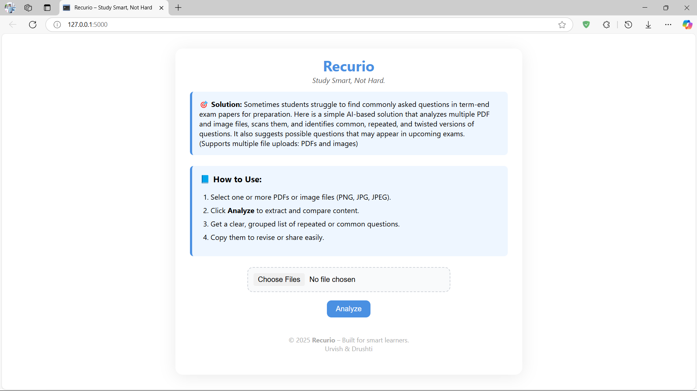
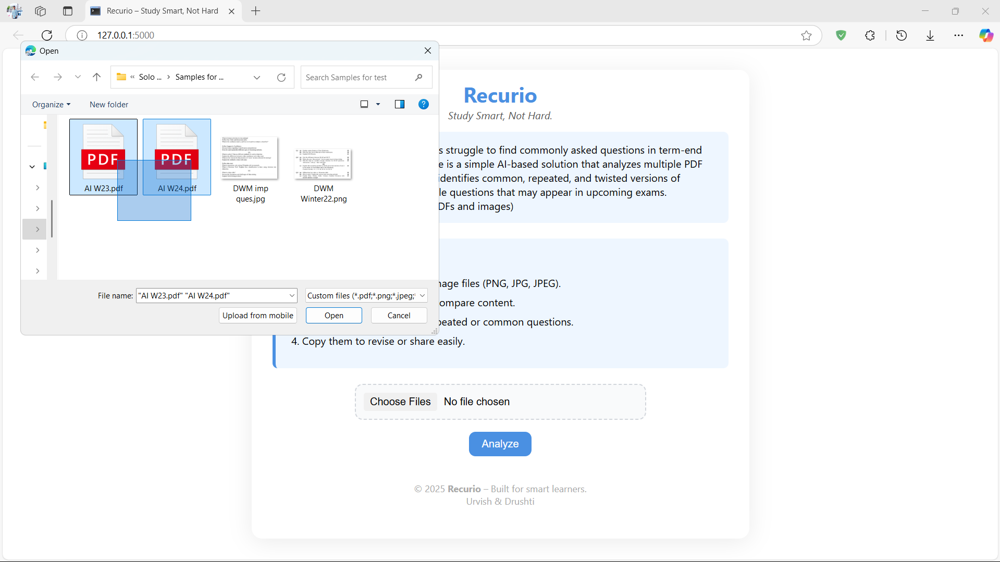
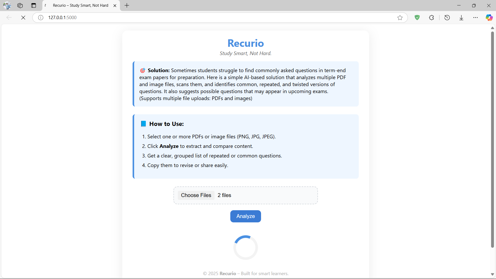
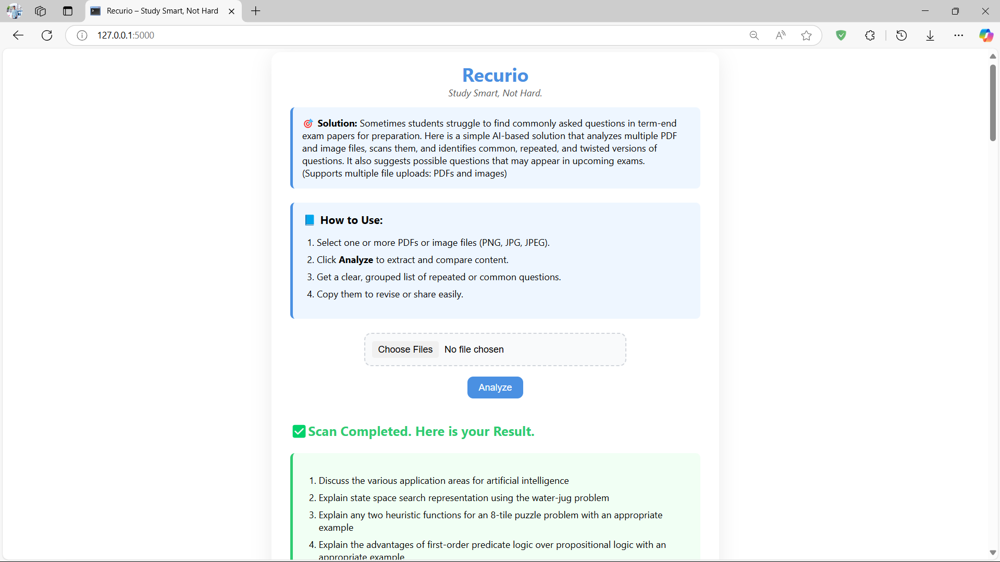
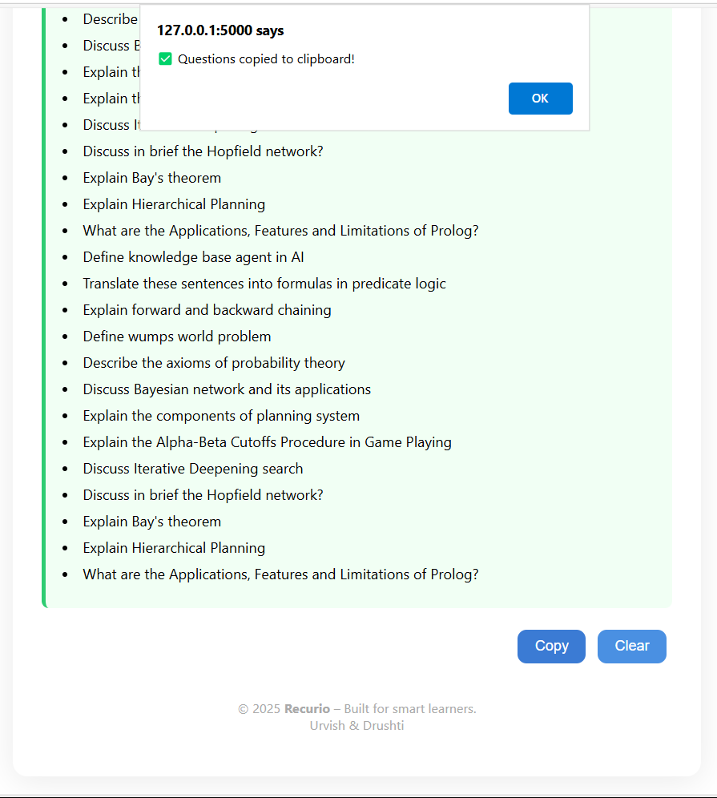

# Recurio - A smart learning tool 🧾

## **📸 ScreenShots**
### **1. Home page of Site. 🏠**

A project that find repeatative text by analysing files. Best tools for Student who can scan previous year papers and quickly find out repeative one to target/cover that first.😎🧠

---

Selecting mulitple files for input.

---

Processing...

---

Output:

---

---

### *feature*
### - It allows multiple files to scan text and give proper output. and more inhanced version provide multiple image scaning at a time and find repeatative question which students need.✨
---
Thank you for Showing Interest.😇
Open to contribute. 🫱🏻‍🫲🏻
---

@ Project By Urvish Patel